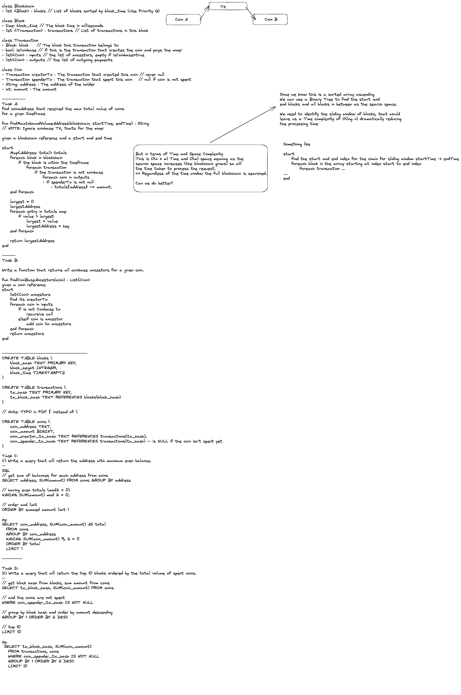

# Assignment

###### Kieran Mc Gowan kmg_cv@yahoo.com 14/3/2023

### Task A:
Write a function that outputs the address that received the maximum total value of coins for a given time range.

Note: There are 2 implementations provides (separate branches)
- main - binary search of the blockchain space - O(log n) time
- linear-search-n-by-m-time linear search of the full blockchain space - O(n*m) time

See [src/main/kotlin/com/example/chain/service/BlockchainService.kt](src/main/kotlin/com/example/chain/service/BlockchainService.kt#L5)

### Task B:

Write a function that returns all coinbase ancestors for a given coin.

See [src/main/kotlin/com/example/chain/service/BlockchainService.kt](src/main/kotlin/com/example/chain/service/BlockchainService.kt#L3)

### Task C:
Write a query that will return the address with maximum even balance.
```postgresql
SELECT coin_address, SUM(coin_amount) AS total 
  FROM coins
  GROUP BY coin_address
  HAVING SUM(coin_amount) % 2 = 0
  ORDER BY total 
  LIMIT 1
```

### Task D:
Write a query that will return the top 10 blocks ordered by the total volume of spent coins.

```postgresql
SELECT tx_block_hash, SUM(coin_amount) 
   FROM transactions, coins
   WHERE coin_spender_tx_hash IS NOT NULL
   GROUP BY 1 ORDER BY 2 DESC
   LIMIT 10
```

### Work Scratchpad:


----

### Clean
```
./gradlew clean
```
OR
```
gradle.bat clean
```

### Build & run all tests
```
./gradlew build
```
OR
```
gradle.bat build
```


